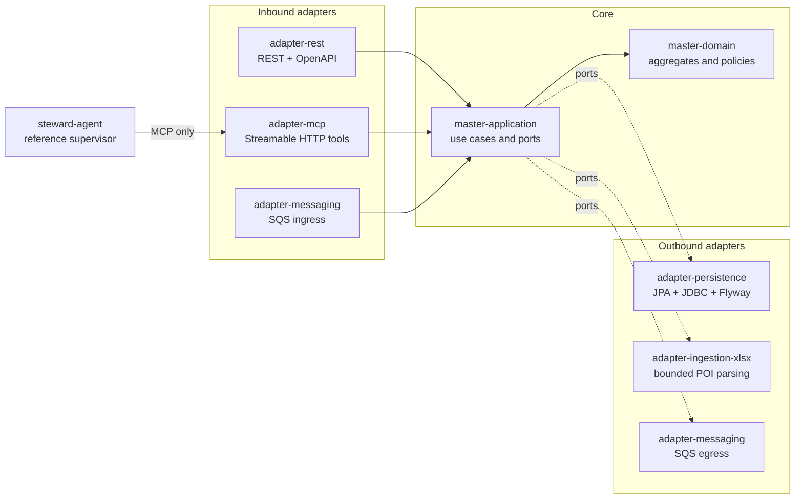
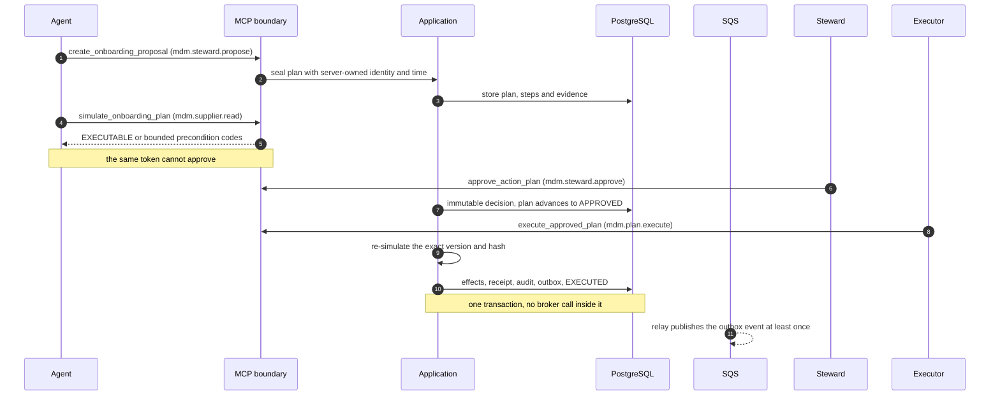
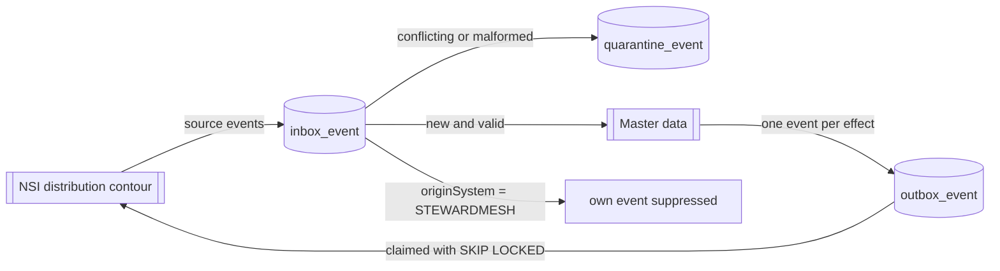

# StewardMesh

**Agentic Master Data Control Plane for Retail**

StewardMesh is a greenfield Java/Spring platform for governed supplier onboarding and master-data stewardship. It combines an explainable Partner & Location MDM core, headless REST/MCP capabilities, a reference agent, and reliable integration with an enterprise reference-data distribution contour.

The repository contains the executable foundation for the first supplier-intake vertical slice. For contribution and branch rules see [CONTRIBUTING.md](CONTRIBUTING.md).

## Repository map

```text
.github/workflows/   CI workflows
contracts/           Versioned REST, MCP and event contracts
deploy/local/        Local PostgreSQL and LocalStack dependencies
evals/               Frozen agent scenarios and graders
master-data-service/ Modular MDM service
steward-agent/       Reference MCP-based agent
test-fixtures/       Synthetic workbooks and integration events
scripts/             Small reproducible developer utilities
```

## Architecture

Dependencies point inward. The domain holds invariants and knows no framework; the application layer
owns use cases and declares ports; adapters implement those ports; only the composition root wires
them. An architecture test fails when an inward module reaches outward, and separately when a guarded
package name matches no class, so the rule cannot pass vacuously.



The agent reaches master data only through MCP. It never receives database or broker credentials, and
approval and execution scopes are absent from every phase allowlist it can hold.

### Governed change

A model may propose. It may not decide, and it may not apply. Each transition is a separate call with
its own OAuth scope and its own authenticated principal, and each one binds the exact plan version and
hash so a plan cannot be swapped between the decision and the effect.



### Integration lineage

StewardMesh integrates with the reference-data distribution contour rather than replacing it. The
canonical envelope separates where data came from, who produced it and which transport carried it, so
an owned event returning through the distributor is suppressed instead of applied a second time.



Delivery is explicitly at least once. Identity is a stable business event id plus a payload
fingerprint, never a broker message id, so a redelivery is recognised as a replay rather than a new
fact.

## Product boundary

The MVP masters supplier parties and supplier sites and assigns them to procurement/client business units. It does not master products, customers, employees, contracts, payments, or the complete internal organization hierarchy.

## Current decisions

- Java 25 and Spring Boot 4.0.5.
- Modular monolith for the authoritative MDM service.
- Separate thin reference agent consuming only MCP contracts.
- PostgreSQL with immutable JSONB source assertions and explicit indexed matching columns.
- Inbox/outbox integration with broker-neutral application ports.
- SQS adapter in the target stack; RabbitMQ compatibility for an enterprise NSI distribution contour.
- Greenfield implementation rather than a fork of an existing MDM product.

## Delivered milestones

Phase 1 delivers the first intake vertical slice on the Maven foundation:

`XLSX upload -> S3 artifact -> ImportJob -> SourceRecord -> validation report`.

The proof covers a valid workbook, deterministic mixed-row evidence, idempotent replay, duplicate source-identity recovery, hostile input rejection, and infrastructure failure boundaries.

```text
POST workbook -> immutable S3 object -> artifact/job transaction
                                      -> bounded XLSX parsing
                                      -> source rows/report transaction
GET status/report <------------------- validated or failed job
```

Phase 2 delivers deterministic supplier source normalization, bounded identity resolution, stewardship routing and explainable golden records. Original assertions remain unchanged; separately stored canonical values carry the exact normalization ruleset identifier so matching and golden-record projections can be reproduced. PostgreSQL blocking produces bounded party and site candidates, then the versioned `supplier-identity-v1` ruleset calculates basis-point scores from identifier equality and token similarity. Authoritative identifier conflicts prevent automatic links.

Every candidate decision is stored immutably with its ruleset, outcome, score, hard-conflict flag and complete feature evidence. Evidence contains stable feature codes and contributions, never raw supplier values. Repeating the same source-version/ruleset evaluation is idempotent.

Validated imports can be handed to a resumable matching use case. It rejects stale source versions before processing, reuses already persisted evaluations after a retry, and finishes as `MATCHED` or `REVIEW_REQUIRED`. Review/conflict outcomes create one immutable, idempotent stewardship case per source version and scoring ruleset. Read-only OAuth-protected endpoints expose bounded status, candidates, explanations and current golden records without bypassing the application layer.

Phase 3 now includes governed action plans through execution and a Streamable HTTP MCP boundary. Six versioned tools keep reading, simulation, proposal, human approval/rejection and execution as separate calls. Exact plan version/hash bindings, per-tool OAuth scopes and server-derived caller identities prevent a model from granting itself authority; execution commits master effects, audit and outbox atomically and is idempotent per authenticated subject and request key.

The integration boundary now relays canonical v1 envelopes through SQS. Transactional inbox deduplication, payload fingerprints, monotonic business-unit reference versions, redacted quarantine evidence and explicit own-event suppression prevent replay or relay loops from producing a second effect. The outbox publisher claims bounded PostgreSQL batches and records broker acknowledgements while preserving at-least-once semantics.

Phase 4 starts with value-free intake profiling, deterministic column mapping and an active reference steward agent. The agent is a separate model-independent supervisor that advances through `PROFILE`, `IDENTIFY`, `PLAN`, and `VERIFY` under fixed per-phase MCP allowlists, mandatory evidence checklists and a 16-call ceiling. It can create and simulate a proposal but cannot approve or execute it. Its production transport performs authenticated Streamable HTTP MCP calls and retains decision codes plus tool outcomes without hidden reasoning or credentials. MCP results enter the reasoner only through a bounded, canonical and integrity-bound `UNTRUSTED_TOOL_EVIDENCE` envelope that remains structurally separate from trusted control policy.

## Build and run

Java 25 is required. Maven is supplied by the repository wrapper.

```bash
./scripts/verify-phase-3.sh
./scripts/run-local.sh
```

At startup, the service connects to PostgreSQL, applies the Flyway intake schema, validates its JPA mappings and configures immutable intake storage plus bounded supplier-workbook parsing. The supplier intake API is published under `/api/v1/supplier-imports`; its OpenAPI document is available at `/v3/api-docs`.

The API is an OAuth2 resource server. Configure `STEWARDMESH_JWK_SET_URI` for the JWT issuer and `STEWARDMESH_JWT_AUDIENCE` for the audience this deployment answers to; the service refuses to start when the audience is empty, because a resource server without one accepts any token its issuer signed for any service. Upload requires `supplier-import.write`; status and report reads require `supplier-import.read`.

The MCP endpoint at `/mcp` authorizes each tool separately: `mdm.supplier.read` for reads and simulation, `mdm.steward.propose`, `mdm.steward.approve` and `mdm.plan.execute` for the governed steps. The local Keycloak realm ships one service account per role — `stewardmesh-agent` (read, propose), `stewardmesh-steward` (read, approve) and `stewardmesh-executor` (read, execute) — alongside the `stewardmesh-local` REST client. Distinct subjects are what let the local stack demonstrate that a proposer cannot approve its own plan. A repository gate fails when the realm cannot grant a scope the published MCP contract requires. All these credentials are development-only placeholders and must never be reused outside a workstation.

With the service running, exercise token acquisition, upload and idempotent replay in a second terminal:

```bash
./scripts/smoke-local.sh
```

Use the returned `statusUrl` and `reportUrl` with a token carrying `supplier-import.read`. Identity-resolution and golden-record reads require `identity-resolution.read`. The versioned response and problem schemas live in the [supplier-import contract](contracts/openapi/supplier-imports-v1.yaml) and [identity-resolution contract](contracts/openapi/identity-resolution-v1.yaml).

## Phase 2 reproducible demo

The Phase 2 E2E proof starts a disposable PostgreSQL instance and exercises the real application, persistence and REST boundaries with synthetic data. It covers a new supplier, an exact duplicate, a fuzzy review, a conflicting authoritative identifier and an existing party with a new site. The proof also checks deterministic reruns, stewardship-case idempotency, golden-record provenance, bounded read APIs, metrics and a ten-second latency smoke threshold.

```bash
./mvnw --batch-mode --no-transfer-progress \
  -pl master-data-service/bootstrap-master-service -am verify \
  -Dit.test=IdentityResolutionEndToEndIT \
  -Dfailsafe.failIfNoSpecifiedTests=false
```

Run `./scripts/verify-phase-2.sh` for the complete repository gate, including both black-box E2E flows, aggregate coverage, Compose validation and Git hygiene checks. The same post-build gates are mandatory in pull-request CI. Java 25 and Docker are required; all demo identities are generated synthetic fixtures.

## Phase 3 reproducible demo

The Phase 3 acceptance proof synchronizes a versioned synthetic business unit from SQS, deduplicates its replay, and then drives one immutable onboarding plan through scoped MCP proposal, simulation, independent human approval and idempotent execution. It verifies the committed master projection, receipt, audit and outbox in PostgreSQL, publishes the canonical master event to a real LocalStack queue, and proves that a returned owned event is durably loop-suppressed without a second business effect.

```bash
./mvnw --batch-mode --no-transfer-progress \
  -pl master-data-service/bootstrap-master-service -am verify \
  -Dit.test=Phase3GovernedExecutionEndToEndIT \
  -Dfailsafe.failIfNoSpecifiedTests=false
```

Run `./scripts/verify-phase-3.sh` for the complete repository gate. All Phase 3 fixtures, identities, reference events and supplier values are synthetic.

## Concurrency smoke

`SupplierIntakeLoadSmokeIT` drives the deployed stack over real HTTP with real signed tokens, because a load check that bypasses the servlet container and the security filter chain measures something the deployment never runs. Twelve tenants import concurrently and eight identical requests race one idempotency key.

It asserts invariants rather than speed: every tenant keeps its own import, no projection identity is duplicated by a lost update, and a raced idempotency key collapses into exactly one import with exactly one attempt reporting itself as the original. The latency ceilings are generous enough to stay meaningful on slower hardware; they catch a collapse, not a regression of a few milliseconds.

```bash
./mvnw --batch-mode --no-transfer-progress \
  -pl master-data-service/bootstrap-master-service -am verify \
  -Dit.test=SupplierIntakeLoadSmokeIT -Dfailsafe.failIfNoSpecifiedTests=false
```

Actuator health, metrics and Prometheus output are exposed under `/actuator`. Metrics cover intake outcomes, rows, artifact bytes, stage duration/failures, validation codes, match-scoring duration/failures, bounded candidate counts and decision outcomes.

Governed execution and messaging are instrumented at the composition root rather than inside the use cases, so a metric can never roll back a business transaction. Counters separate approvals from rejections and first decisions from idempotent replays, time and count executions with their committed effects, and record inbox ingress by outcome and reason, event lag, and broker delivery success or failure per event type. Structured logs report quarantine, loop suppression and failed delivery with the event id, event type and reason code.

Every label is drawn from a closed vocabulary. Subjects, plan hashes, approval reasons, event identifiers and producers are never labels, and tests assert the resulting label cardinality. Console logs use structured JSON and never include workbook rows or supplier identifiers.

## Local dependencies

```bash
cp .env.example .env
docker compose --env-file .env -f deploy/local/compose.yaml up -d --wait
```

This starts Keycloak, PostgreSQL and LocalStack with the development S3 bucket and SQS queues. See [the local environment guide](deploy/local/README.md).
